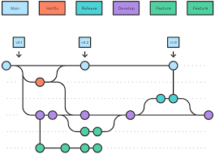
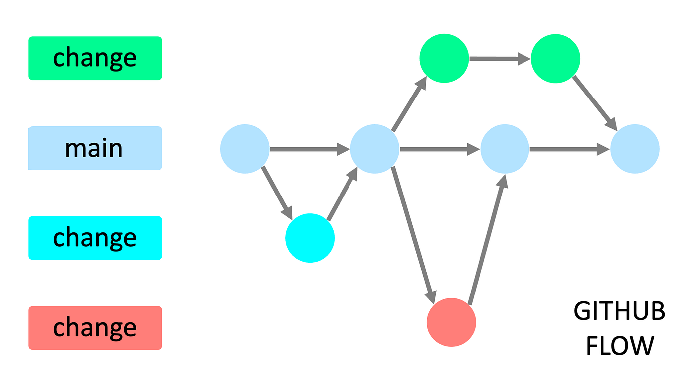

# Clase 1

¿Que es un control de versiones?
es un sitema que registra cada cambio en el codigo de un proyecto

¿por que es importante?
.Rendimiento: solo guarda lo necesario
.Seguridad: conserva toda accion
.Flexibilidad:no es necesario un desarrollo lineal

¿Que es git?
un controlador de versiones

¿Que es un repositorio?
es una carpeta donde se guardan todos las versiones hechas en el proyecto 

¿para que sirve el comando git init?
$ git init ---> inicia el repositorio

¿para que sirve el comando git --help?
$ git --help ---> muestra los comandos que se puede usar

# clase 2

¿Que es un commit?
un commit registra cambios que se hicieron en el repositorio

¿Como hacer hago Commit?
$ git commit ---> para guardar los cambios en el area de staging
$ git commit -m "añadir mensaje"---> el mensaje añadido se usara como titulo en tu commit

¿Que es el HEAD?
el HEAD es un puntero que apunta al repositorio actual donde se esta trabajando

¿Que es una rama?
es un nuevo apuntador hacia una de las confirmaciones, 
es como una division que creara "una copia" del repositorio donde se podra hacer cambios

# clase 3
¿Para que sirven las ramas?
permiten un desarrollo no lineal y colaborativo donde otras paersonas puedan colaborar

¿Como fusionar ramas?
nos referimos a que los cambios de la rama se integran en otra rama 
$ git merge ---> comando para fusionar ramas

acabamos de fusionar un archivo c++ de rama_c a la rama principal master

¿por que eliminar ramas?
por buena practica y las ramas tienen un proposito unico de corto periodo

comandos sobre ramas
$ git branch ---->ver ramas
$ git switch nombreRama ---> cambiar de rama
$ git checkout nombreRama ---> cambiar de rama
$ git checkout -b nombreRama -----> creamos una rama

## conflictos en git?????
eso sucede cuando se ha realizado cambios en las mismas lineas en un fichero
## ¿Como resolver?
nos quedamos con los cambios de la rama main
nos quedamos con los cambios de la rama changes
modificamos para hacer una fusion personalizada

# clase 4
## ¿git y github son lo mismo?
no, git es un control de versiones 
github es un servicio de alojamiento en la nube basado en el sistema git

## git es unico?
no, existe Bitcket, GitLab

$ git remote add origin linkDeGit ----> para conectar git y github
$ git clone <url>  ----> descargar un repositorio

comandos git push 
$ git push -----> enviar los cambios
$ git pull -----> desarga y fusiona los cambios del repositorio remoto

¿Que es una pull Request?
es una peticion para cambios 
¿Como se hace un pr?
subir nuestra rama con git push y
1 la rama que se subio recientemente tendra la opcion en github >code
o
2 ir al apartado Pull Request
## prueba de imagen

# clase 5
## ¿Que es un gitFlow?
es la manera en que un equipo de desarrollo utiliza Git

## git flow
es el flujo de trabajo mas antiguo, utiliza las ramas:
1 main o master: contener el codigo de produccion
2 develop: codigo que esta en desarrollo en pruebas y ser validada

## GitHub Flow
Rama main y yalquiera otra rama que quiera ser integrada da un Pull Request

## Trunk Based Development
solo la rama main y ramas auxiliares efimeras que quiera ser integrada por medio de una Pull Request
util si se cuenta cn un sistema CI/CD

## Ship/Show/Ask
1 ship: se fusiona una rama principal sin revision
2 show: abre una paticion de cambios para que sea revisado por CI
3 Ask: abre una P para discutir los cambios antes de fusionarlos
## Reglas de SSA
-tenemos un vuen sistema de CI/CD
-confiamos en el equipo y existen las buenas practicas de desarrollo
- Las revisiones de codigo no son requerimients
-Las ramas son lo mas pequeñas con un tiempo de vida corto y salen directaente de la rama principal
-El equipo sabe lidiar con el ego individual, las personas confian en el resto del equipo
